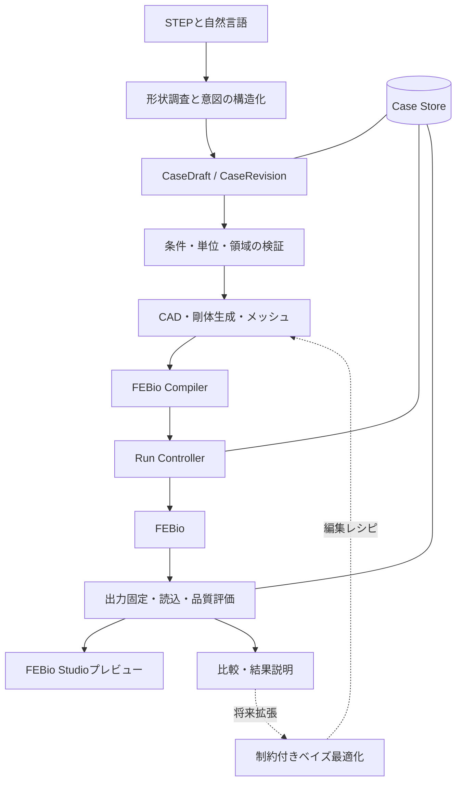
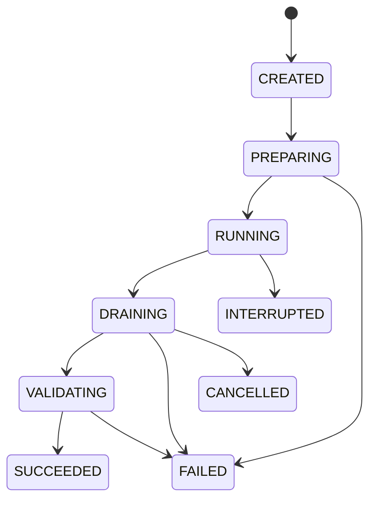

# FEBio CAE Harness V2 — プロトタイプ設計仕様書

文書版: 0.2 / 作成日: 2026-09-07 / 更新日: 2026-09-09 / 状態: 実装用設計、一般的な実機適合性は未検証。
ファイル名の日付は文書識別子であり、作成日ではない。
対応する工程・受け入れ試験は[実装計画書](../plans/2026-08-27-febio-cae-harness-greenfield-plan.md)に定義する。

## 1. 目的と完成条件

STEPで与えた部品に、寸法と配置を指定して新しく生成した剛体治具を接触させ、押し込みによる部品の変形を解析する。自然言語で解析条件を入力・変更し、FEBioの実行からXPLTのプレビュー、変更前後の比較までを同じケースで追跡できることを目的とする。

完成したプロトタイプは、入力の根拠、生成した解析モデル、実行したソルバー、検証した結果を一つの記録として再現できる。必要な物理条件が不足する場合は、未確定項目を示して解消を待つ。任意の形状・材料・接触条件に対して収束を保証する製品ではなく、対応範囲内の解析を完遂するか、到達状況と未解決原因を正確に返す製品とする。

本書と実装計画書が製品の仕様決定元である。READMEは案内、レビュー・試験記録は証拠であり、別の製品仕様を定義しない。外部資料はFEBio等の機能確認に用い、ローカル環境での成功証拠とは区別する。

開発上の意思決定はPM兼PdM（`gpt-6-astra` / `xhigh`）が担う。承認済み要求内で優先順位、範囲、技術方針、受け入れ基準、有限予算を決定し、製品動作・受け入れの変更は本書と実装計画書へ反映してから実装する。実装担当は単独の`gpt-6-astra` / `low`、独立レビューは別タスクの`gpt-6-astra` / `medium`とする。最小限のテストと機能追加で計画を進める具体的な手順は[開発契約](../../AGENTS.md)と実装計画書10節に従う。これは開発体制であり、製品のLLM adapterのモデル要件を変更しない。

PM兼PdMの裁量は物理条件の推測や未承認の実データ・native操作を許可しない。材料・荷重・拘束・接触・ROIは権威ある根拠に従い、必須実E2Eと最終BottomFrameの完成条件を維持する。

## 2. プロトタイプの対応範囲

| 項目 | 対応範囲 |
|---|---|
| 実行環境 | Windows、Python 3.12、headless CLI。FEBioとFEBio Studioは外部インストール |
| 入力形状 | STEP内から明示的に選択した1つの閉じたソリッド。複数ボディなら対象を指定 |
| 治具 | 1つの球・円柱・直方体。寸法、姿勢、位置を明示して生成する剛体 |
| 解析 | 3次元構造、単調な変位制御の準静的押し込み。幾何学的非線形を扱う |
| 材料 | 初期対応候補は等方線形弾性と圧縮性neo-Hookean。根拠のある適用範囲で使用 |
| 接触 | 部品と治具の1組。摩擦なし、または明示した一定のCoulomb摩擦係数 |
| メッシュ | 部品はTet10候補。治具も独立したメッシュを持ち、FEBioの剛体として定義 |
| 結果 | 部品変位、指定したひずみ・応力、治具変位・反力、接触診断、XPLT |
| 部分変更 | 材料値、支持・接触領域、摩擦、治具形状・配置、押し込み履歴、メッシュ、評価条件 |
| 比較 | 反力―治具移動量曲線、同じ評価定義による部品の変形、必要な場の比較 |

材料・要素・接触方式の組合せはP0の実機試験で対応表を確定する。候補のうち未検証の組合せは公開CLIで実行可能と宣言しない。未対応の材料や現象を対応済みのモデルへ自動置換しない。

塑性・損傷・粘弾性、衝撃・慣性を伴う動解析、除荷・繰返し履歴、多数部品の接触、シェル化、実行途中の再メッシュ、自由形状最適化は初期対応外とする。準静的・速度非依存として扱える根拠がないケースは、必要な情報を確認するか未対応理由を返す。元のSTEP部品形状の自動編集はストレッチ段階で追加する。

## 3. 要求一覧

| ID | 必須要求 |
|---|---|
| REQ-01 | STEP部品と新規剛体治具の接触押し込み解析を一貫して扱う |
| REQ-02 | Python 3.12のheadless CLIとし、Codex Desktop・Orcaを実行時依存にしない |
| REQ-03 | 材料・支持・接触・運動・ROIの根拠を保持し、不明な必須物理条件のみASK_AND_BLOCKにする |
| REQ-04 | STEP単位、座標変換、ボディ選択、治具形状を再現できる |
| REQ-05 | CAD領域とメッシュ集合の対応を各版で検証し、曖昧な再対応を拒否する |
| REQ-06 | 要素の節点順、面の向き、品質、接触面の独立性を検証する |
| REQ-07 | 剛体自由度、接触、押し込み履歴を明示的にFEBioへ変換する |
| REQ-08 | 同一仕様と対応ツールから同じ意味の解析入力を生成し、実行入力の実体を固定する |
| REQ-09 | 実行・中断・再試行・プロセス所有権を永続的に管理する |
| REQ-10 | 出力の所属と内容を検証し、古い・途中の・改変された結果を完成結果として公開しない |
| REQ-11 | ソルバー終了、数値品質、物理モデルの妥当性を別々に記録する |
| REQ-12 | 対象XPLTをFEBio Studioでプレビューし、起動と読込確認を区別する |
| REQ-13 | 元の解析を保存し、変更を新しい不変のケース版として残す |
| REQ-14 | 評価位置、履歴、領域、単位、集計方法を固定して比較する |
| REQ-15 | LLM出力を型付き操作へ限定し、計算・実行許可・成功判定はコードが担う |
| REQ-16 | 質問をケース版へ結び付け、古い回答・差分・二重実行を拒否する |
| REQ-17 | ケースデータとコードを分離し、実CAEデータ・認証情報をGitへ含めない |
| REQ-18 | LLM呼出し、再試行、経過時間、計算資源に上限を設け、キャッシュを検証する |
| REQ-19 | clean wheelインストールからCLIと必要な実行経路を検証する |
| REQ-20 | 指定ローカルゲートと実E2E、最終BottomFrame E2Eの証拠で完成を判定する |

## 4. アーキテクチャと責務

ドメイン型を中心とする単一Pythonパッケージとし、CAD・メッシュ・ソルバー・ビューアをアダプターとして分離する。ネイティブ処理とFEBioは所有する子プロセスで実行し、異常終了をCLIから隔離する。



| モジュール | 入出力と責務 |
|---|---|
| `domain` | 共通型、ID、単位、状態、仕様の不変条件。ネイティブツールを呼ばない |
| `application` | ケース操作、検証、状態遷移、実行権限の発行、依存順序 |
| `adapters.geometry` | STEP調査、領域解決、パラメータ付き剛体生成 |
| `adapters.meshing` | メッシュ生成、領域集合、品質・節点順変換 |
| `adapters.febio` | 対応版への変換、実行、ログとXPLTの読込 |
| `adapters.viewer` | 外部FEBio Studio起動とプレビュー記録 |
| `adapters.llm` | 構造化された提案、質問文、診断・結果説明 |
| `storage` | SQLiteの登録・状態と、不変の入力・出力ファイル群 |
| `cli` | 人間向け表示と機械向けJSON。同じapplicationサービスを呼ぶ |

CAD・メッシュの第一候補はGmshのPython APIとOpenCASCADEである。[S1](#s1) FEBio入力・実行・XPLT出力は公式CLIを使う。[S2](#s2) ビューアはFEBio Studioのポスト処理を使う。[S3](#s3) これらの組合せの採用判定はP0の互換性記録に基づく。Python側の型検証にはPydantic、永続状態には標準SQLiteを候補とし、依存バージョンをP0で固定する。

## 5. 共通データ契約

### 5.1 型と所有者

すべての永続契約は`schema_version`を持つ。正規化JSONでキー順、浮動小数点の表現、単位、集合順序を規定し、NaN・無限大・重複IDを拒否する。数値許容差による比較と、バイト内容の同一性によるハッシュを混同しない。

正規化はdomainの単一関数が所有する。オブジェクトのキーと意味上順不同の集合は整列し、運動履歴等の順序を持つ配列は保持する。UTF-8、空白なしのJSON表現、型ごとの数値表現をschema v1の試験で固定する。版ダイジェストには仕様・根拠の内容とschema版を含め、自己参照するハッシュ欄や作成時刻を含めない。

| 型 | 必須情報 | 更新規則 |
|---|---|---|
| `EvidenceRef` | 出典種別、参照先、対象フィールド、元情報のダイジェスト | ユーザーの明示指示または登録資料へ解決可能 |
| `CaseDraft` | 草案ID、世代番号、入力意図、確定値、未解決フィールド | compare-and-swapで更新 |
| `IssuedQuestion` | 質問ID、草案ID・世代、対象フィールド、質問時の根拠集合 | 対象世代で一度だけ回答を適用 |
| `CaseRevision` | ケースID、親版、仕様、根拠、仕様ダイジェスト | 凍結後は不変。READYはサービスが再計算 |
| `SelectionRef` | 名前、役割を指定した根拠、形状版、座標系、選択規則、解決結果 | 生の面番号だけで永続化しない |
| `MeshArtifact` | 形状・メッシュレシピのハッシュ、ツール版、要素・集合・品質記録 | 元の形状・領域へ追跡可能 |
| `ExecutionBundle` | ケース版、実行入力全ファイルのハッシュ、対応ツール・設定 | 実行開始前に固定 |
| `AttemptRecord` | 試行ID、実行ID、bundle、所有世代、プロセス情報、数値設定、状態 | 追記型の履歴と原子的状態更新 |
| `ResultManifest` | 試行ID、入力ハッシュ、出力パス・サイズ・ハッシュ、読込結果 | writer終了・出力固定後に公開 |
| `QualityAssessment` | 対象manifest、評価方針版、各基準・値・判定・未検証項目 | 再評価は新しい評価記録 |
| `ComparisonSpec` | 基準・比較run、変更目的、共通条件、評価軸・領域・集計・単位 | 不変の比較要求 |
| `PreviewReceipt` | manifest、XPLTハッシュ、Studio版、起動・読込状態、確認根拠 | 読込確認の証拠を別保存 |

共通型と状態遷移はP1で単一所有者が固定する。各アダプターが独自のケース型や成功フラグを製品の正とすることを禁止する。

### 5.2 CaseSpecの物理仕様と計算仕様

`CaseRevision.spec`は次のフィールドを持つ。未確定の必須物理値を含む草案からExecutionBundleを作成できない。

| フィールド | 内容・制約 |
|---|---|
| `geometry` | STEPの内容ハッシュ、対象body、STEP単位、座標変換、形状調査記録 |
| `material` | 材料モデル、単位付き係数、出典、適用ひずみ・速度範囲の根拠 |
| `support` | 領域参照と自由度。拘束を追加して剛体モードを自動解消しない |
| `rigid_tool` | primitive種別、正の寸法、位置・姿勢、接触面、6自由度の指定 |
| `motion` | 明示した単位方向、単調な移動量履歴、基準位置、準静的適用の根拠 |
| `contact` | 部品面と治具面、摩擦モデルと係数、初期配置の意図 |
| `mesh_policy` | 要素型、全体・局所サイズ、領域、品質基準、細分化上限 |
| `solver_policy` | 対応solver profile、数値許容差、増分制御、再試行レシピ |
| `outputs` | 必須の場・剛体履歴・接触診断、保存状態、評価要求 |
| `quality_policy` | 完了位置、接触、釣り合い、メッシュ依存性の基準と適用理由 |
| `budget` | 総経過時間、試行数、CPU、LLM呼出し数・トークン上限 |

物理的なゼロと未指定は異なる。摩擦なし、全体評価、回転固定、初期隙間ゼロも根拠付きの明示値として扱う。根拠はユーザー指示、登録済み材料・試験条件等から解決する。LLMの確信度は根拠にならない。

物理的意味を持たない数値設定は、検証済みprofileの範囲でサービスが選べる。数値設定の変更で材料、支持、摩擦、最終移動量、実際の負荷履歴を変えてはならない。

### 5.3 単位と座標系

量は値と単位を対で保持する。STEPの宣言単位と明示指示が矛盾する場合は競合として解消する。CADカーネル内の単位とソルバー単位の変換を記録し、FEBioへはSIの整合単位系に正規化した節点・物性・運動を出力する。mm・N・MPa等の表示値はmanifestの単位情報から変換する。

形状配置、治具運動、反力、評価座標の基準フレームをIDで指定する。方向ベクトルは正規化し、姿勢は検証した剛体変換で表す。表示カメラの上下を解析方向として解釈しない。

## 6. 形状・剛体・メッシュ

### 6.1 形状調査と領域指定

公開STEP準備経路の前提として、Gmsh設定にAP214必須指定、期待するOpenCASCADE版、正のCPU worker数を任意指定できるようにする。AP214指定時はSTEPのHEADER内のFILE_SCHEMAをインポート前に検査する。OpenCASCADE版は所有するGmshセッションの`General.BuildInfo`にあるOCCT版と厳密に照合し、欠落・曖昧・不一致なら未対応として形状操作前に停止する。別途インストールしたOCCTの版は代用しない。CPU数は所有セッション内の`General.NumThreads`へ設定する。既存経路の未指定時の動作と戻り値契約は維持する。

この前提実装は公開CLI接続、実機適合性、メッシュ品質の合格を意味しない。将来の公開準備経路ではGmsh 4.15.2・OCCT 8.0.1とAP214を要求するが、ここでは期待値を設定可能にする段階とし、実機検証前に対応済みとは表示しない。

STEP調査はボディ数、閉じたソリッドか、単位、体積、境界面、幾何学的欠陥を報告する。体積・面積・距離・向きは選択を解決するための幾何情報であり、材料や支持の意味を付与しない。

領域はCAD属性名、明示したボディと座標条件、またはユーザーが選択した面の集合で定義する。CLIは番号付きの調査図と領域一覧を出力できる。これは静的成果物であり、製品GUIを追加しない。曖昧な「上側」等は座標系と対象を確定させる。

各SelectionRefに元形状ハッシュ、解決した面、面積・重心等の検証値を保存する。同一形状の再メッシュでも集合の非空性・対象ボディ・被覆を再検証する。形状変更後に一意に解決できない場合は条件を未解決へ戻す。面番号だけの一致、最近傍だけの一致を物理条件の継承根拠としない。

### 6.2 剛体生成と接触

公開準備コマンドは`case --state-dir STATE prepare-planar CASE_ID --file REQUEST --expected-generation N --json`とする。既存のSpecUpdateRequest（PartialCaseSpec、evidence、source_declarations）を再利用し、初期範囲を平面・box治具・AsPlacedに限定する。呼出側のMeshArtifact、互換性のSUPPORTED宣言、生成receiptは受け付けず、登録済みSTEPを現在のGmsh 4.15.2・OCC 8.0.1・AP214検査付き操作で処理する。既存の互換性profileは正確なdigestで解決し、この要求から登録・置換しない。

初回入力のため、prepare-planarのprivate正規化だけはgeometry.geometry_digest、geometry.inspection_digestと対応する部品SelectionRef.geometry_digestのnullを許す。値は今回の子プロセスが登録済みSTEPから取得したinspectionだけで確定する。非nullの宣言が実測digestと異なる場合は拒否し、黙って置換しない。source digest、body、単位、配置、選択規則、物理条件と根拠は明示のまま保持し、選択が今回のinspectionで一意に解決できない場合は停止する。共通domain schemaのnull許容範囲は広げない。

準備の既定上限はwall time 600秒、メッシュ生成1回、四面体100000要素、250000節点とする。privateなpreparation要求拡張で有限の時間・件数上限を明示できるが、無制限値、隠れた再試行、自動粗分割は認めない。CPUは実行時の利用可能論理CPU数を検出してより低い明示値を尊重する。メモリは開始時の利用可能物理メモリの80%を総物理メモリ以下で計算し、正確なbytesを記録して所有子プロセスの境界で強制する。wall deadlineも所有子プロセスを終了させて強制し、処理後の経過時間確認だけで代用しない。solverの3600秒・1試行は後続solver工程の目標であり、準備でsolverを起動する理由にも精度保証にもならない。

生成側だけがcase-localのPREPARING/FAILED/PREPARED記録を発行し、入力digest、spec/evidence/snapshot/generation、module identityと実測版、inspection/mesh/recipe/outputのdigestと結果を結び付ける。既存のevidence leaseとCASを使い、最終receiptを原子的に公開する。freeze後の採用・公開に失敗した版は不完全なままであり、この公開経路の版は対応するPREPARED記録なしに実行・preflightできない。複数DBにまたがるrollback保証や汎用transaction層は追加しない。既存demo経路とその合成証拠は維持し、準備完了とnative適合性・表面精度・解析成功を区別する。

球は半径、円柱は半径・高さ、直方体は3寸法を持つ。位置・姿勢と運動方向は独立したパラメータである。初期配置を接触させる処理は、指定した相手領域・方向・隙間から一意に計算できる場合だけ実施し、計算した配置を記録する。

治具と部品は独立してメッシュ化し、接触境界の節点を共有・溶接しない。治具にはFEBioの剛体定義を使う。並進3成分・回転3成分を、拘束・指定運動・明示的自由のいずれかへ解決する。初期対応では横移動・回転を固定した一方向の運動profileを用意し、指定した物理条件と一致する場合に使用する。

接触は対応表で固定したsurface-to-surface方式へ変換する。primary/secondary、面の法線、摩擦、penalty等の数値係数、接触探索設定を明示して保存する。FEBioには摩擦と非貫通を扱うSliding-Elasticの理論があるが、採用する具体的な入力語彙と要素組合せは実機で検証する。[S4](#s4)

### 6.3 メッシュの検証とキャッシュ

Tet10の候補経路では、GmshからFEBioへの節点順と面節点順を明示的に変換する。要素ID、面方向、Jacobian、退化、集合への所属、曲面の近似誤差、接触境界の独立性を検証する。高次化だけを品質保証として扱わない。

形状修復が形状を変える場合、元形状との差と変更根拠を必要とする。薄肉を自動でシェルへ変換したり、接触対象を自動で結合したりしない。対応品質を満たせない形状は原因付きで停止する。

キャッシュキーは形状内容、剛体生成レシピ、分割に使う領域、メッシュ設定、変換器とネイティブツール版を含む。再利用前に内容ハッシュと領域対応を検証する。初期版ではソルバー結果の自動キャッシュは行わず、明示的に選択した既存runの再評価のみを許す。

## 7. 入力生成と実行管理

### 7.1 コンパイルと実行権限

CompilerはCaseRevision、検証済みMeshArtifact、対応表から`.feb`と要求出力を生成する。XML断片や任意コードをLLMから受け付けない。境界面、材料とdomain、剛体、load controller、出力変数を照合する。

実行直前にapplicationが登録済みケースと最新草案世代、凍結版、根拠、入力ハッシュ、実行予算を再検証し、実行サービス内部の許可を作る。ファイル内の`approved: true`や呼出し側の自己申告で許可を作れない。明示済みの条件と許可範囲では追加確認を要求しない。

入力は試行専用ディレクトリへ固定する。実行ファイルの絶対パス、版・ハッシュ、使用設定、関連ライブラリ・プラグイン、コンパイラ版、引数配列、cwd、スレッド数を記録する。P0で確認したCLI引数を使い、シェル経由の文字列実行はしない。入力の外部includeや書込み先は登録済みbundleの範囲に制限する。

### 7.2 状態と異常終了

ケースの準備状態は`DRAFT / NEEDS_INPUT / READY`とし、runの状態と分離する。



`SUCCEEDED`は要求終端までの実行と出力の完全性が確認できた状態である。数値品質とプレビューは別の記録とし、run成功だけで解析タスク全体を完了にしない。起動前キャンセルは所有プロセスなしを確認してCANCELLEDへ遷移できる。

Run ControllerはPIDだけでなく生成時刻、所有世代、Windows Job Object等で所有プロセス群を識別する。正常終了・タイムアウト・キャンセルのいずれでも、所有する子孫の終了と出力writerの解放を確認してから結果を検証する。他のFEBio/Studioセッションを終了させない。

CLIがクラッシュした場合は永続記録と所有プロセスを照合する。自動で同じrunを二重起動せず、残存プロセスと出力の扱いを確定する。所有権が確認できない場合はINTERRUPTEDのまま診断を返す。

再試行は新しいAttemptRecordと新しい出力領域を作る。許可した増分細分化、反復制御、検証済みの接触数値設定変更だけを行い、履歴と残予算を引き継ぐ。収束判定を強制した結果を成功証拠にしない。初期版の再解析は初期状態から実施し、XPLTをrestartデータとみなさない。

### 7.3 出力の所属と固定

各試行は空の固有出力領域から始める。終了コード、ログ、最終状態、出力要求を合わせて判定し、同名ファイルの存在や更新時刻だけで成功としない。

所有writer終了後に出力の読み取り・ハッシュ計算・固定を行い、入力bundleと結び付けたResultManifestを原子的に公開する。読込中の変更、別試行への差替え、切り詰め、リンクの差替えを検出する。比較・プレビュー時にも対象ハッシュを検証し、改変後は既存の評価・読込確認を有効としない。

## 8. 結果、品質、プレビュー

### 8.1 数値データの抽出

対応XPLT版のヘッダ・辞書・メッシュ・状態・要求変数を専用readerで解釈する。圧縮、変数の型、配置、単位、積分点と節点の違いを対応表に固定し、未対応形式は明示的に拒否する。可視化用の平滑化値を無断で評価値として使わない。

部品変位、評価に必要な応力・ひずみ、接触診断をXPLTまたは同じ試行の要求済み数値出力から取得する。治具の移動量・反力は対応版で検証した剛体の数値履歴から取得する。必要な値が出力されていない場合は未検証とし、ゼロで代用しない。要求変数名・格納位置・符号の対応はP0で固定する。

### 8.2 指標の定義

| 指標 | 定義 |
|---|---|
| 治具移動量`q` | 初期基準位置からの並進を、指定した押し込み方向へ射影した値 |
| 抵抗力`F` | 治具の反力を押し込み軸へ射影し、抵抗を正とする符号へ変換した値 |
| 部品変形 | 指定領域の変位ベクトル、成分、ノルム。対象状態と集計法を保存 |
| 接触食い込み | 正を分離とするgapへ正規化した後の`max(0, -gap)` |
| 応力・ひずみ | 応力測度・ひずみ測度、成分、基準座標、データ配置を指定 |
| 接触開始 | 閾値と判定法を定めた最初の接触状態。移動量ゼロと区別 |

反力の符号は単純な既知条件の試験で確認する。`q`は治具の総移動量であり、初期隙間を除いた押し込み深さとは区別する。接触開始からの深さを比較する場合は別の評価軸を明示する。

### 8.3 品質方針

`QualityAssessment`は実行成立、数値品質、物理的適用根拠を分け、各項目を`PASS / FAIL / UNVERIFIED / NOT_APPLICABLE`で記録する。NOT_APPLICABLEには理由を必要とする。

- 要求した最終移動量、状態、出力変数がそろい、必須配列に非有限値がない。
- 接触を要求した区間で接触が成立し、初期干渉・食い込みが基準を満たす。
- 剛体治具の運動と、部品支持・接触集合が指定どおりである。
- 準静的条件に対応した反力・外力の釣り合いと、残差を満たす。
- 対象評価量について、局所細分化を含むメッシュ依存性が基準を満たす。
- 材料モデルの適用範囲、負荷・支持の根拠、実物との照合状況を表示する。

数値許容値はQualityPolicyに保存する。実物の許容ひずみ等は数値収束許容値とは別の物理的基準であり、推測しない。局所最大応力の特異性がある場合、最大値の安定だけを一般的な合格条件とせず、根拠のある領域・集計・収束指標を定める。

### 8.4 プレビューとタスク完了

`preview --open`は登録済みXPLTのハッシュを確認して外部FEBio Studioを起動する。プレビュー状態は`REQUESTED / LAUNCHED / CONFIRMED / FAILED`とする。プロセス起動だけではCONFIRMEDにしない。

CONFIRMEDには、対象ファイル、Studio版、最終状態、必要な変数の表示を確認した根拠が必要である。対応版に公式の確認インターフェースがある場合は検証して利用し、それ以外は人による確認とケース領域の証拠を記録する。確認時のXPLTハッシュと現在値を照合する。検証手順に用いる外部操作ツールは製品の実行時依存にしない。

解析タスクの完了は、要求終端への到達、結果の完全性、必須数値品質、要求されたプレビュー確認を満たした時点とする。物理的な実物検証が別途必要なら、その未検証状態を結果と併記する。プレビュー未確認を物理条件不足のASK_AND_BLOCKへ変換しない。

## 9. 部分変更と比較

部分変更は親版ダイジェストを持つ`CasePatch`とする。変更可能なパス・型・根拠を検証し、親版が異なる差分を適用しない。元の版、入力、結果は不変とする。Studio等で外部編集した`.feb`は初期版では自動同期せず、管理仕様との不一致を診断する。

| 変更 | 再実行する処理 |
|---|---|
| 材料値、摩擦、支持、押し込み履歴 | 領域・物理仕様の再検証、コンパイル、解析、結果評価 |
| 治具形状・配置、メッシュ方針 | 影響する形状・領域・メッシュの再生成と、以降の処理 |
| 評価状態、集計、比較表示 | 必要な出力が既存runにそろえば新しい評価記録だけ作成 |
| 追加の場・未保存の状態が必要 | 出力要求を変更した版を作り、初期状態から解析 |

ComparisonSpecは基準と候補のResultManifest、意図した変更、固定すべき条件、評価軸、共通区間、ROI、単位、応力・ひずみ測度、集計法を固定する。意図した材料・摩擦等の変更は比較差分として明示し、意図しない差分は不整合として返す。

単調な履歴の共通移動量で比較し、補間方法を記録する。存在しない範囲への外挿をしない。再メッシュした場は節点番号で直接引き算せず、領域集計、共通の物理位置、検証済みの場の写像を使う。写像誤差・未被覆領域を示す。初期版は領域集計と曲線比較を必須とし、場の差分画像は検証済みの写像がある場合だけ作る。

表示倍率、色範囲、状態、単位をそろえる。基準値がゼロの相対差は未定義として絶対差を示す。低品質・途中・異なる物理履歴の結果を、完成した同等条件の結果として順位付けしない。

## 10. LLMとCLIの契約

LLMに渡す情報は、必要な形状要約、明示条件、未解決事項、変更差分、集計結果と関連ログに限定する。CAD全体や認証情報を自動送信しない。出典資料内の指示文を操作権限として解釈しない。

LLMは構造化された提案を返し、applicationがスキーマ、参照先、根拠、単位、対応範囲、親版、予算を検証する。任意のPython、シェル、XML、ファイルパスへの書込み命令は実行しない。外部LLMの提供者はアダプターで切替可能とし、資格情報は環境またはOSの保管機能で解決する。

質問は必要な項目をまとめ、取得済みの根拠で解消できる項目を再質問しない。古い質問への回答は現行草案を変更できない。数値設定の選択やツール欠落は物理条件の質問と分け、構造化診断にする。

以下は実装予定のCLI契約であり、現時点で存在するコマンドではない。

| コマンド | 動作 |
|---|---|
| `febio-cae --version` / `doctor` | 製品版、登録したツールと対応表、実行能力の状態 |
| `case create --case-root <path> --cad <path>` | 許可された領域へケースと形状参照を登録 |
| `case inspect <case-id>` | ボディ・領域一覧、単位、調査図、未解決事項 |
| `case spec <case-id> --file <json> --expected-generation <n>` | 型付き明示仕様と根拠の宣言を現行草案へCASで適用。未確定値は未解決のまま保持し、物理値を補わない |
| `case intent <case-id> --text <text>` | 自然言語を草案へ適用し、確定値・差分・質問を返す |
| `case answer <case-id> --question <id> --text <text>` | 現行世代の質問へ回答 |
| `case validate <case-id>` / `case freeze <case-id>` | 検証と不変版の作成。凍結も再検証を必要とする |
| `run <case-id> --revision <id>` | 検証済み版を予算内で実行。完了または明示的な未完了理由を返す |
| `status <run-id>` / `cancel <run-id>` / `resume <run-id>` | 永続状態、所有プロセスの取消し、状態照合と再開判断 |
| `preview <run-id> --open` | 結果の検証とStudio起動 |
| `preview <run-id> --confirm --evidence <path>` | 読込確認の記録。内容ハッシュを再検証 |
| `case edit <case-id> --base <revision> --text <text>` | 親版を指定した部分変更の草案 |
| `compare <baseline-run> <candidate-run> --spec <path>` | 型付き比較条件で差分・曲線・レポートを作成 |

最初の明示仕様経路は`case spec`を使い、LLM接続を必要としない。JSONは共有schemaの型・単位・根拠宣言として検証し、ケースID、現行世代、根拠の解決・鮮度、凍結と実行許可は登録済みサービスが検証する。ファイル中の`approved`や`ready`等を権限として使わず、自然言語経路にも同じ検証・凍結規則を適用する。

各操作は`--json`を持ち、`schema_version, status, case_id, revision_id, run_id, diagnostics, next_actions`を返す。適用外IDはnullで表す。終了コードは0=操作成功、2=入力または比較条件不正、3=物理条件待ち、4=環境・未対応能力、5=実行失敗、6=結果完全性・必須品質不合格、7=キャンセル・中断、8=競合・古い世代とする。`status`の読取成功はrun成功を意味せず、返却JSON内の状態を解釈する。

runに関する応答には`run_status, quality_status, preview_status, task_status`も含める。`task_status`は既存の記録からapplicationが導出する`READY / NEEDS_INPUT / RUNNING / NEEDS_PREVIEW / COMPLETE / FAILED / INTERRUPTED`であり、呼出し側が書き込む成功フラグにはしない。計算と必須品質が成立していても、要求した表示が未確認ならNEEDS_PREVIEWと返す。`preview --open`の起動成功も読込確認を意味しない。終了コード0とタスク全体のCOMPLETEを区別する。

## 11. 保存、再現性、データ境界

製品コードはリポジトリ内、実ケースは明示的に登録したケース領域に保存する。すべての`02_CAE`はツールリポジトリの外部データとして扱う。最終の許可済み実E2Eまでは実データ領域へ書き込まない。開発時の合成形状は`.local/synthetic`等へ生成する。

```text
<registered-case-root>/
  registry.sqlite3
  cases/<case-id>/
    sources/             入力スナップショットと出典
    revisions/<id>/       凍結した仕様・根拠
    geometry/<hash>/      生成レシピ・形状調査
    meshes/<hash>/        メッシュ・集合・品質
    runs/<run-id>/
      attempts/<id>/     入力bundle・ログ・出力
      manifests/         固定した結果記録
    assessments/<id>/    品質評価
    comparisons/<id>/    比較条件・数値・表示成果物
    previews/<id>/       読込確認の根拠
```

SQLiteの状態更新とファイル公開の中間で停止しても復旧できるよう、準備→固定→公開の手順を記録する。ケースIDを登録から解決し、任意パスから実行権限を再構成しない。書込み・削除前には正規化パス、リンク・reparse point、所有範囲を確認する。元CADを上書きしない。

初期プロトタイプは単一ユーザーのPCで動くheadless CLIとし、実行アカウントと製品内コードを信頼する。同じアカウント権限の別プログラムによる意図的な妨害、書込み途中の敵対的hardlink・一時ファイル別名生成は保護対象外とする。入力パス・既存リンクの検査、誤上書き防止、元CAD保全、所有とCASによる協調的な同時実行制御、原子的保存とクラッシュ復旧は維持する。対象外の再現記録は既知の制限として保持し、防御成功とは扱わない。この保護のための独立アカウント・特権サービス・brokerは初期プロトタイプに追加しない。

Gitには実CAEモデル、結果、認証情報、デスクトップ状態を含めない。合成fixtureは小さな生成コードとして管理し、生成したCAD・FEBio・XPLTは追跡しない。`.gitignore`とCAE境界スキャナー、コミット対象の検査を組み合わせる。

再現性記録にはソフトウェア版・入力ハッシュ・数値設定・スレッド数・乱数seedを含める。ネイティブ処理のビット単位の再現性は未実証として扱い、結果比較には宣言した数値許容差を使用する。

経過時間、ピークメモリ、要素数、増分・反復数、再試行数、LLM呼出し数とトークン数をrunごとに記録する。処理中は状態・到達位置・残予算を取得可能にする。キャッシュヒットと新規計算を区別し、性能値には使用機と対応版を添える。

## 12. ストレッチ: 制約付き形状最適化

ST-01として`DesignSpace / GeometryRecipe / ObjectiveSpec / OptimizationStudy`の拡張点だけを予約する。初期プロトタイプの実装対象には含めない。

STEPからCADの編集履歴を復元できるとは仮定しない。編集できる寸法、対象領域、操作、上下限、保持する面・体積・干渉等の制約を明示したレシピ、または元CADのパラメータAPIを必要とする。形状更新後は領域対応とメッシュを再検証する。

候補生成→CAD制約確認→同じ解析仕様で評価→結果検証→観測追加を繰り返す。設計変数の制約と、反力・変位・ひずみ等の結果制約を分ける。BoTorchは両種の制約を扱う候補である。[S5](#s5)

目的の例は、指定移動量での反力を要求範囲に保ちながら質量を減らすことである。すべての数値限界と評価領域は明示した設計条件に由来する。CAD生成失敗・未収束・低品質は欠測と失敗理由を記録し、良好な目的関数値を与えない。境界付近の不確実性を扱い、最終候補を新規runと細分化で確認する。最適性の大域保証は行わない。

## 13. 未確定事項と検証の入口

| 項目 | 解決する工程 | 決定する内容 |
|---|---|---|
| FEBio・Studio・Gmshの対応版 | P0 | 実体、版、ハッシュ、機能、入力・結果形式、起動方法 |
| 材料・Tet10・接触の適合 | P0→P3 | ネイティブ名称、節点・面順、出力変数、受け入れ証拠 |
| XPLTの対応範囲 | P0→P3 | バイナリ版、圧縮、要求変数・配置、独立した数値照合 |
| 実部品の物理条件 | P7ケース準備 | 材料、支持、治具、押し込み、摩擦、評価と基準 |
| 実機の時間・メモリ目標 | P0→P6 | 使用機、要素数、実測、ケースごとの予算 |
| BottomFrame最終ケース | P7 | 正式な対象、許可パス、操作範囲、評価条件 |

未確定な物理条件に既定値を埋めた実行例は本書に置かない。仕様・契約の実装と合成形状の検証は、実部品の条件が未確定でも進められる。

## 14. 根拠台帳と参考資料

確認日: 2026-09-07。外部機能の記述は公式資料のPublished、採用構成は設計上のInferenceである。対応版候補はAssumptionとしてP0で置換する。本書では実部品の数値計算を実施しておらず、Calculationに相当する解析結果はない。

| ID | Type | 根拠・判断 | 適用先・限界 |
|---|---|---|---|
| S1 | Published | GmshにはPython APIとOpenCASCADEによるSTEP取込がある | CAD/メッシュ候補。FEBioとの相互運用は未実証 |
| S2 | Published | FEBioはCLIから入力、ログ、plotファイルを指定できる | 実行アダプター。ローカル実行の証拠ではない |
| S3 | Published | FEBio Studioはplotファイルのポスト処理環境を持つ | プレビュー。自動読込確認APIの存在は未確定 |
| S4 | Published | Sliding-Elasticは接触、滑り、摩擦を扱う | 接触候補。使用版・要素組合せは実機検証が必要 |
| S5 | Published | BoTorchは設計変数制約と結果制約を扱う | ストレッチの候補選定 |
| D1 | Inference | 型付き仕様と決定的な操作でLLMから実行・判定を分離する | 本プロトタイプの設計判断 |
| D2 | Inference | 不変版、出力ハッシュ、独立した品質判定で比較を追跡する | 実装と逆境試験で確認する |
| A1 | Assumption | 2種の材料・Tet10・接触の候補経路が実装可能 | P0で対応表へ置換。未確認時は能力を公開しない |

<a id="s1"></a>
- S1: [Gmsh Reference Manual — Geometry module / API](https://gmsh.info/doc/texinfo/#Geometry-module)。参照資料は4.15.2。

<a id="s2"></a>
- S2: [FEBio User Manual 4.9 — The Command Line](https://help.febio.org/docs/FEBioUser-4-9/UM49-Section-2.3.html)。CLIと出力指定。

<a id="s3"></a>
- S3: [FEBio Studio Manual 2.8 — The Post Environment UI](https://help.febio.org/docs/FEBioStudio-2-8/FSM28-Section-13.1.html)。検索索引で確認できた本文を参照。ローカル版は未確認。

<a id="s4"></a>
- S4: [FEBio Theory Manual 4.8 — Sliding-Elastic](https://help.febio.org/docs/FEBioTheory-4-8/TM48-Subsection-7.1.9.html)。検索索引で確認できた本文を参照。入力ファイルの互換性を保証する資料ではない。

<a id="s5"></a>
- S5: [BoTorch — Constraints](https://botorch.org/docs/constraints)。設計変数制約と結果制約の区別。
